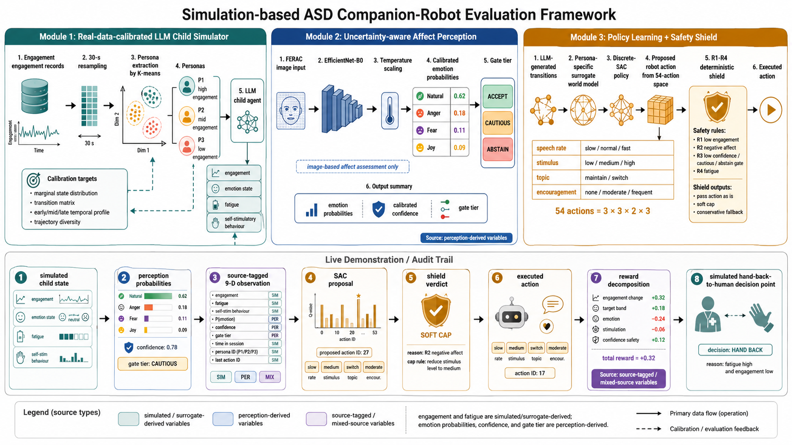
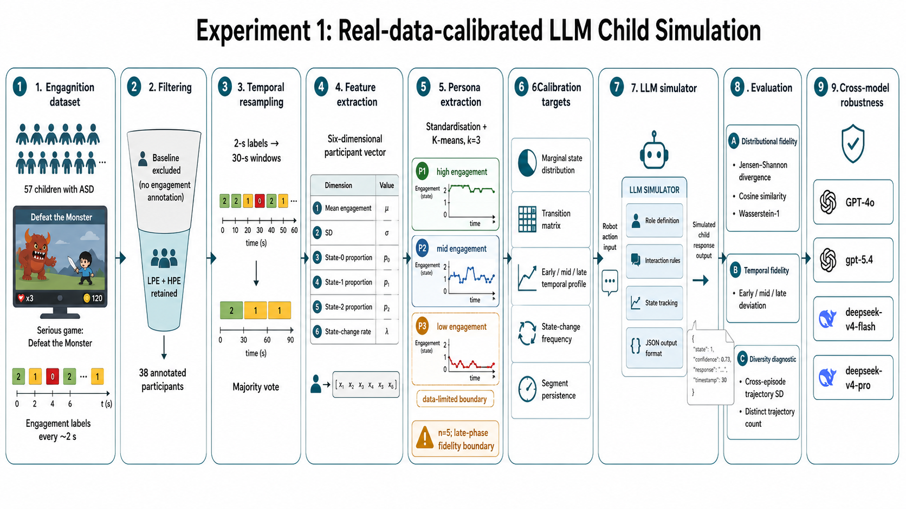
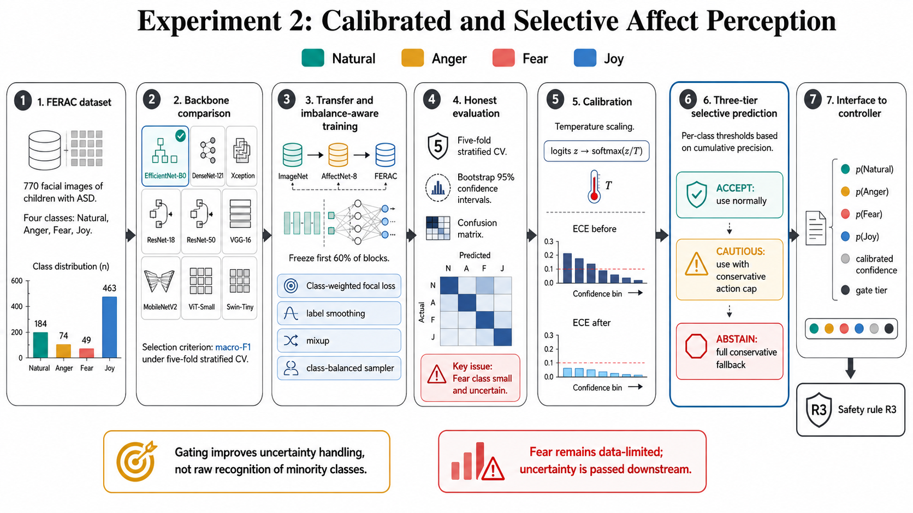
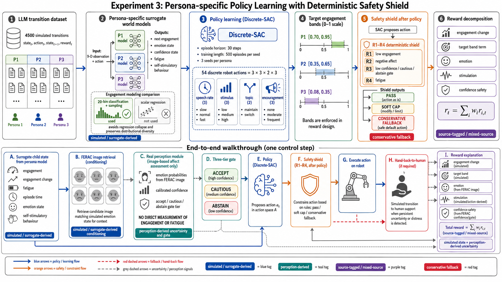
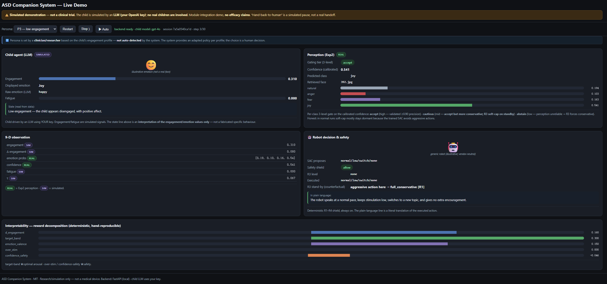

# ASD Companion System

A simulation-first companion robot research system for adaptive ASD support scenarios. The project combines a child-state simulator, confidence-aware emotion perception, and a safety-shielded policy controller into one inspectable end-to-end loop.

This repository is packaged as a runnable system project. It intentionally excludes paper drafts, LaTeX sources, raw datasets, local notebooks with drafting notes, and real environment files.



## What It Does

- Simulates child engagement and affect dynamics for controlled interaction testing.
- Runs facial-emotion perception with calibrated confidence and abstention.
- Selects robot actions with personalized SAC policies.
- Applies deterministic safety rules before actions reach the interaction layer.
- Provides a static walkthrough viewer and a local live demo.

## Safety Scope

This project is a research and simulation framework, not a medical device. It has not been clinically validated and does not claim therapeutic efficacy. The live demo uses simulated child-state dynamics; human handoff events in traces are represented as system states, not real clinical intervention.

## Quick Start

### Static Walkthrough

Open the static viewer directly in a browser:

```text
results/index.html
```

The viewer replays a recorded episode from `results/walkthrough.json`.

### Local Live Demo

```bash
python -m venv .venv
.venv\Scripts\activate
pip install -r requirements.txt
copy .env.example .env
python app/backend/server.py
```

Then open:

```text
app/frontend/index.html
```

Add your own `OPENAI_API_KEY` to `.env` for the live simulator. Real `.env` files are ignored and must not be committed.

## Project Layout

```text
asd-companion-system/
├── app/                    # backend API and browser frontend
├── common/                 # shared path utilities
├── components/             # simulator, perception, policy, safety modules
├── docs/                   # system-level docs and public figures
├── models/                 # release checkpoints used by demos
├── results/                # static walkthrough viewer and trace
├── system/inference/       # perception contract and inference helpers
├── data/README.md          # dataset acquisition notes only
├── .env.example            # placeholder environment template
└── requirements.txt
```

## Main Modules



`components/exp1_simulator/` contains the LLM-based child-state simulator and calibration utilities.



`components/exp2_emotion/` contains the emotion-recognition pipeline, calibration tools, and abstention gate.



`components/exp3_policy/` contains surrogate world-model training, SAC policy training, baseline comparison, safety checks, and walkthrough generation.

## Demo Interface



The local demo keeps the API key on the backend. The frontend only receives interaction state, perception status, action decisions, and safety explanations.

## Data And Checkpoints

Raw FERAC and Engagnition data are not redistributed. See `data/README.md` for expected layouts and acquisition notes.

The repository keeps only demo-oriented checkpoints in `models/` and derived public artifacts needed for the walkthrough. Large training datasets, raw participant records, paper-specific source files, and private notes are excluded.

## Environment

Use `.env.example` as the template:

```text
OPENAI_API_KEY=your_key_here
OPENAI_CHILD_MODEL=gpt-4o
```

Never commit `.env`, numbered key files, or local credential exports.

## License

MIT. Research/simulation use only.
